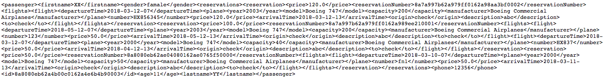
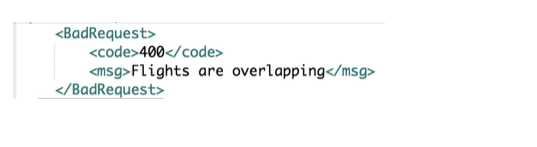

# ReservationSystem
Reservation System application using technologies: 

• SpringBoot  
• JPA  
• JDBC 
• MVC 
• MySQL 
• AWS 
• JUnit 

Features: 

• Manages the addition/viewing/updation/deletion for passengers, flights and reservations  
• Use of JPA Mappings(One to One, Many to One, Many to Many) to build relationships between tables  
• Additional features of error handling like no time overlapping for flights can be booked, a flight with reservations cannot be deleted etc.,  
• Tested using JUnit  
• Deployed on AWS  

Steps to run the application:

1. Open the project in IntelliJ.
2. Click on Run button on the top right corner.

Below are some screenshots demonstrating the application:

### Get a passenger back as JSON(Success)

### Get a passenger back as JSON(Error Handling)

### Get a passenger back as XML(Success)

### Get a passenger back as XML(Error Handling)

### Create a passenger(Success)

### Create a passenger(Error Handling)

### Update a passenger(Success)

### Update a passenger(Error Handling)

### Delete a passenger(Success)

### Delete a passenger(Error Handling)

### Get a reservation back as JSON(Success)

### Get a reservation back as JSON(Error Handling)

### Make a reservation(Success)

### Make a reservation(Error Handling)

### Update a reservation(Success)

### Update a reservation(Error Handling)

### Search for reservations(Success)

### Search for reservations(Error Handling)

### Cancel a reservation(Success)

### Cancel a reservation(Error Handling)

### Get a flight back as JSON(Success)

### Get a flight back as JSON(Error Handling)

### Get a flight back as XML(Success)

### Get a flight back as XML(Error Handling)

### Create or update a flight(Success)

### Create or update a flight(Error Handling)

### Delete a flight(Success)

### Delete a flight(Error Handling)

