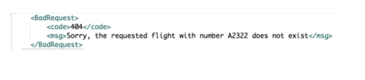

# ReservationSystem
Reservation System application using technologies: 

• SpringBoot  
• JPA  
• JDBC 
• MVC 
• MySQL 
• AWS 
• JUnit 

Features: 

• Manages the addition/viewing/updation/deletion for passengers, flights and reservations  
• Use of JPA Mappings(One to One, Many to One, Many to Many) to build relationships between tables  
• Additional features of error handling like no time overlapping for flights can be booked etc.,  
• Tested using JUnit  
• Deployed on AWS  

Steps to run the application:

1. Open the project in IntelliJ.
2. Click on Run button on the top right corner.

Below are some screenshots demonstrating the application:

### Console showing the activities:

